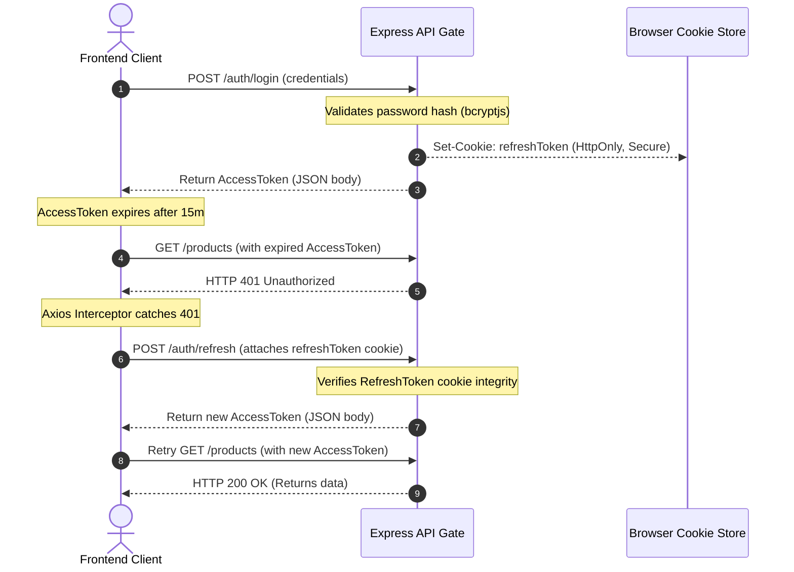
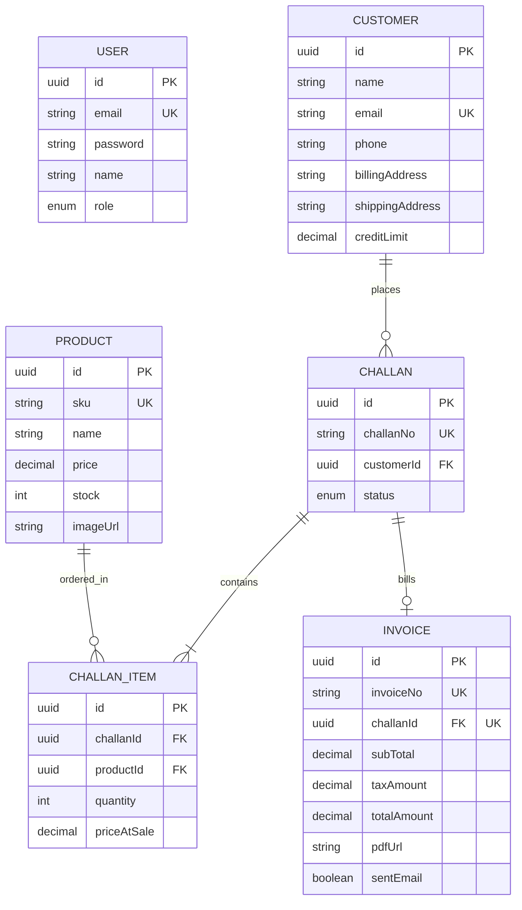

# System Architecture & Technical Specifications

This document outlines the architectural blueprints, database design, communication flows, state management, and deployment topologies for the NextGen ERP + CRM platform.

---

## 1. Directory Tree & Monorepo Design

The repository uses a workspace layout containing separate folders for the frontend client and the backend APIs:

```text
d:\CRM\
├── .github/                         # Workflows folder for CI/CD pipelines
│   └── workflows/
│       └── deploy.yml               # CI/CD deployment definitions
├── backend/                         # Express API (TypeScript)
│   ├── prisma/                      # Database models
│   │   ├── schema.prisma            # Prisma relational models
│   │   └── seed.ts                  # Seed scripts
│   ├── src/
│   │   ├── config/                  # DB, mail, logger configurations
│   │   ├── controllers/             # Handler layer (interprets HTTP calls)
│   │   ├── middleware/              # JWT validations and error handling
│   │   ├── routes/                  # Express route bindings
│   │   ├── services/                # Business logic implementation
│   │   ├── validators/              # Input parameters schema validation
│   │   ├── app.ts                   # Express server initialization
│   │   └── server.ts                # Server listener
│   ├── Dockerfile                   # Multi-stage Docker configuration
│   └── tsconfig.json
├── frontend/                        # React Client (Vite + TypeScript)
│   ├── src/
│   │   ├── assets/                  # CSS layout files
│   │   ├── components/              # Shared UI components (tables, inputs)
│   │   ├── layouts/                 # Dashboard page shells (navbar, sidebar)
│   │   ├── pages/                   # Main views (products, customers, login)
│   │   ├── store/                   # Redux state slices & actions
│   │   └── utils/                   # Axios configuration
│   ├── Dockerfile                   # Multi-stage Docker configuration
│   └── tailwind.config.js
└── docker-compose.yml               # Unified compose orchestration
```

---

## 2. Communication & Request-Response Lifecycles

All API requests pass through a series of middleware filters before executing database operations:

```
[Client Request]
       │
       ▼
┌──────────────┐
│ Express Route│ (Entry mapping - src/routes)
└──────┬───────┘
       │
       ▼
┌──────────────┐
│ Validations  │ (Input parameters validation - src/validators)
└──────┬───────┘
       │
       ▼
┌──────────────┐
│ Auth Security│ (Token checks & RBAC validation - src/middleware/auth)
└──────┬───────┘
       │
       ▼
┌──────────────┐
│ Controller   │ (Extracts request payload & formats response - src/controllers)
└──────┬───────┘
       │
       ▼
┌──────────────┐
│ Service Layer│ (Domain logic & database transactions - src/services)
└──────┬───────┘
       │
       ▼
┌──────────────┐
│  Prisma ORM  │ (Generates SQL statements)
└──────┬───────┘
       │
       ▼
┌──────────────┐
│  Database    │ (Neon PostgreSQL execution)
└──────────────┘
```

---

## 3. Authentication & Silent Refresh Flows

Security is enforced using a two-token JWT framework:
-   **Access Token:** Short-lived JWT (15 minutes). Attached to the `Authorization: Bearer <token>` header of API requests.
-   **Refresh Token:** Long-lived JWT (7 days). Stored in a secure, `HttpOnly`, `SameSite=Strict`, `Secure` cookie. Used to rotate access tokens at `/api/v1/auth/refresh`.



---

## 4. Database Schema Design (Prisma)

### Relational Entity Model (ERD)



### Prisma Schema Definitions
```prisma
datasource db {
  provider  = "postgresql"
  url       = env("DATABASE_URL")
  directUrl = env("DIRECT_URL")
}

generator client {
  provider = "prisma-client-js"
}

enum Role {
  ADMIN
  MANAGER
  USER
}

enum ChallanStatus {
  DRAFT
  CONFIRMED
  CANCELLED
}

model User {
  id        String   @id @default(uuid()) @db.Uuid
  email     String   @unique @db.VarChar(255)
  password  String   @db.VarChar(255)
  name      String   @db.VarChar(100)
  role      Role     @default(USER)
  createdAt DateTime @default(now())
  updatedAt DateTime @updatedAt

  @@index([email])
}

model Customer {
  id              String    @id @default(uuid()) @db.Uuid
  name            String    @db.VarChar(150)
  email           String    @unique @db.VarChar(255)
  phone           String?   @db.VarChar(20)
  billingAddress  String    @db.Text
  shippingAddress String    @db.Text
  creditLimit     Decimal   @default(0.00) @db.Decimal(12, 2)
  challans        Challan[]
  createdAt       DateTime  @default(now())
  updatedAt       DateTime  @updatedAt

  @@index([email])
}

model Product {
  id           String        @id @default(uuid()) @db.Uuid
  sku          String        @unique @db.VarChar(50)
  name         String        @db.VarChar(150)
  description  String?       @db.Text
  price        Decimal       @db.Decimal(10, 2)
  stock        Int           @default(0)
  imageUrl     String?       @db.VarChar(255)
  challanItems ChallanItem[]
  createdAt    DateTime      @default(now())
  updatedAt    DateTime      @updatedAt

  @@index([sku])
}

model Challan {
  id         String        @id @default(uuid()) @db.Uuid
  challanNo  String        @unique @db.VarChar(50)
  customerId String        @db.Uuid
  customer   Customer      @relation(fields: [customerId], references: [id], onDelete: Restrict)
  status     ChallanStatus @default(DRAFT)
  items      ChallanItem[]
  invoice    Invoice?
  createdAt  DateTime      @default(now())
  updatedAt  DateTime      @updatedAt

  @@index([customerId])
  @@index([challanNo])
}

model ChallanItem {
  id          String   @id @default(uuid()) @db.Uuid
  challanId   String   @db.Uuid
  challan     Challan  @relation(fields: [challanId], references: [id], onDelete: Cascade)
  productId   String   @db.Uuid
  product     Product  @relation(fields: [productId], references: [id], onDelete: Restrict)
  quantity    Int
  priceAtSale Decimal  @db.Decimal(10, 2)
  createdAt   DateTime @default(now())
  updatedAt   DateTime @updatedAt

  @@index([challanId])
  @@index([productId])
}

model Invoice {
  id          String   @id @default(uuid()) @db.Uuid
  invoiceNo   String   @unique @db.VarChar(50)
  challanId   String   @unique @db.Uuid
  challan     Challan  @relation(fields: [challanId], references: [id], onDelete: Restrict)
  subTotal    Decimal  @db.Decimal(12, 2)
  taxAmount   Decimal  @db.Decimal(12, 2)
  totalAmount Decimal  @db.Decimal(12, 2)
  pdfUrl      String?  @db.VarChar(255)
  sentEmail   Boolean  @default(false)
  createdAt   DateTime @default(now())
  updatedAt   DateTime @updatedAt

  @@index([challanId])
  @@index([invoiceNo])
}
```

---

## 5. Redux Client Architecture

The frontend uses Redux Toolkit to manage global application state:

```
┌────────────────────────────────────────────────────────────────────────┐
│                              Redux Store                               │
├────────────────────────────────────────────────────────────────────────┤
│ • auth: Current user session details & in-memory Access Tokens         │
│ • customer: Directory list, active customer selections                 │
│ • inventory: Product catalog arrays, active item modifications         │
│ • challan: Active challan details, order arrays                        │
│ • invoice: Billing invoice logs                                        │
└────────────────────────────────────────────────────────────────────────┘
```

---

## 6. Hosting & Deployment Topologies

```
┌─────────────────────────────────────────────────────────────┐
│                      Client Browser                         │
└──────────────────────────────┬──────────────────────────────┘
                               │
            ┌──────────────────┴──────────────────┐
            ▼ (HTTPS / Static files)              ▼ (HTTPS / JSON API Calls)
 ┌──────────────────────┐              ┌───────────────────────────┐
 │   Vercel CDN Edge    │              │       Render PaaS         │
 │ (Frontend React App) │              │ (Containerized API Node)  │
 └──────────────────────┘              └─────────────┬─────────────┘
                                                     │ (SSL TCP Tunnel)
                                                     ▼
                                       ┌───────────────────────────┐
                                       │     Neon Database Cloud   │
                                       │    (PostgreSQL Serverless)│
                                       └───────────────────────────┘
```

---

## 7. Containerization & Pipelines

### Multi-Stage Dockerfiles

-   **Backend Dockerfile (`backend/Dockerfile`):**
    *   *Stage 1 (Builder):* Installs development dependencies, runs `npx prisma generate`, and compiles TypeScript files into the `dist/` directory.
    *   *Stage 2 (Runner):* Installs production dependencies only (`npm ci --only=production`), copies files from the builder stage, and exposes port `5000`.
-   **Frontend Dockerfile (`frontend/Dockerfile`):**
    *   *Stage 1 (Builder):* Compiles the React application into static files.
    *   *Stage 2 (Runner):* Copies compiled files to `/usr/share/nginx/html` and serves them using Nginx.

### GitHub Actions CI/CD Pipeline
The workflow configuration is defined in `.github/workflows/deploy.yml`:
-   **Verify Job:** Runs ESLint, validates the Prisma schema, and builds both the frontend and backend applications.
-   **Deploy Job:** Runs on pushes to the `main` branch after the verify job passes. Automatically deploys the frontend application to Vercel and sends a deploy hook request to Render to trigger backend deployment.
