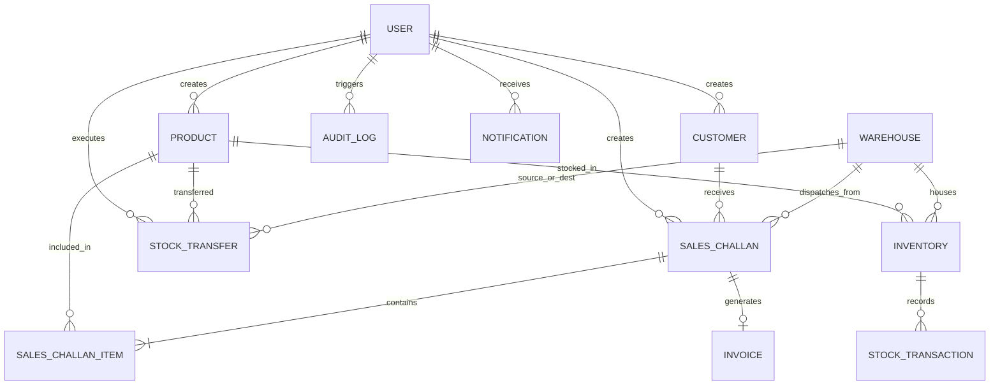

# 🏗️ NextGen ERP + CRM — System Architecture & Technical Specifications

This document outlines the architectural blueprints, database schema designs, communication flows, state management, and deployment topologies for the **NextGen ERP & CRM Platform**.

---

## 📑 Table of Contents
1. [Monorepo Directory Structure](#1-monorepo-directory-structure)
2. [Communication & Request-Response Lifecycles](#2-communication--request-response-lifecycles)
3. [Authentication & RBAC Architecture](#3-authentication--rbac-architecture)
4. [Database Schema & Entity Relationship Diagram (ERD)](#4-database-schema--entity-relationship-diagram-erd)
5. [Prisma ORM Schema Specification](#5-prisma-orm-schema-specification)
6. [Redux Toolkit Client Architecture](#6-redux-toolkit-client-architecture)
7. [Hosting Infrastructure & Deployment Topologies](#7-hosting-infrastructure--deployment-topologies)
8. [Containerization & CI/CD Pipelines](#8-containerization--cicd-pipelines)

---

## 1. Monorepo Directory Structure

The repository uses a workspace layout containing separate projects for the frontend client and the backend APIs:

```text
NextGen-CRM/
├── .github/                         # GitHub Actions CI/CD Pipeline
│   └── workflows/
│       └── deploy.yml               # Automated Build and Deploy Workflow
├── backend/                         # Express REST API Service (TypeScript)
│   ├── prisma/                      # Database Layer
│   │   ├── migrations/              # PostgreSQL Migration Scripts
│   │   ├── schema.prisma            # Prisma Relational Model Definitions
│   │   └── seed.ts                  # Seed Script (Roles, Products, Warehouses)
│   ├── src/
│   │   ├── config/                  # DB connection, Winston logger, Swagger
│   │   ├── controllers/             # HTTP Request Handler Controllers
│   │   ├── middleware/              # JWT verification, RBAC, Rate Limiter
│   │   ├── routes/                  # Express Router Endpoints
│   │   ├── services/                # Business Domain & Transaction Logic
│   │   ├── validators/              # express-validator Rules
│   │   ├── app.ts                   # Express Application Setup
│   │   └── server.ts                # HTTP Listener Entrypoint
│   ├── Dockerfile
│   └── tsconfig.json
├── frontend/                        # React SPA (Vite + TypeScript + Tailwind)
│   ├── src/
│   │   ├── assets/                  # CSS Styles & Design Tokens Index
│   │   ├── components/              # UI Components (Modals, Tables, Forms)
│   │   ├── layouts/                 # Page Layouts (Navbar, Sidebar, Auth Shell)
│   │   ├── pages/                   # Views (Dashboard, CRM, Stock, Challans)
│   │   ├── store/                   # Redux Toolkit Slices & Store Config
│   │   │   └── slices/              # auth, customer, product, inventory, challan, enterprise, dashboard
│   │   └── utils/                   # Axios Interceptors & Helper Functions
│   ├── Dockerfile
│   └── vite.config.ts
├── SETUP.md                         # Local Installation & Execution Manual
├── DEPLOYMENT.md                    # Production Infrastructure Manual
└── docker-compose.yml               # Multi-Container Compose Setup
```

---

## 2. Communication & Request-Response Lifecycles

All REST API requests flow through sequential security and validation layers before interacting with the database layer:

```
[Client Request (Vite React SPA)]
       │
       ▼
┌──────────────┐
│ Express Route│ (Entry route mapping in src/routes)
└──────┬───────┘
       │
       ▼
┌──────────────┐
│ Validations  │ (Input parameters validation - express-validator)
└──────┬───────┘
       │
       ▼
┌──────────────┐
│ Auth & RBAC  │ (Bearer JWT check & Role permission validation)
└──────┬───────┘
       │
       ▼
┌──────────────┐
│ Controller   │ (Extracts request parameters & sends response - src/controllers)
└──────┬───────┘
       │
       ▼
┌──────────────┐
│ Service Layer│ (Business logic & transactional operations - src/services)
└──────┬───────┘
       │
       ▼
┌──────────────┐
│  Prisma ORM  │ (Constructs SQL queries with concurrency locks)
└──────┬───────┘
       │
       ▼
┌──────────────┐
│ Neon Database│ (PostgreSQL Database Engine Execution)
└──────────────┘
```

---

## 3. Authentication & RBAC Architecture

Security is enforced using JSON Web Tokens (JWT) and granular Role-Based Access Control (RBAC):

### System Roles Matrix
- **`ADMIN`**: Complete system access including user administration, system audit logs, database backups/restores, and company settings.
- **`SALES`**: Customer CRM onboarding, sales delivery challan creation, view inventory catalog.
- **`WAREHOUSE`**: Stock catalog management, physical stock IN/OUT transactions, multi-warehouse stock transfers.
- **`ACCOUNTS`**: Read-only financial ledger overview, invoice PDF downloads, sales analytics reports.

---

## 4. Database Schema & Entity Relationship Diagram (ERD)


```mermaid
erDiagram
    USER ||--o{ CUSTOMER : "creates"
    USER ||--o{ PRODUCT : "creates"
    USER ||--o{ SALES_CHALLAN : "creates"
    USER ||--o{ AUDIT_LOG : "triggers"
    USER ||--o{ NOTIFICATION : "receives"
    USER ||--o{ STOCK_TRANSFER : "executes"

    CUSTOMER ||--o{ SALES_CHALLAN : "receives"

    PRODUCT ||--o{ INVENTORY : "stocked_in"
    PRODUCT ||--o{ SALES_CHALLAN_ITEM : "included_in"
    PRODUCT ||--o{ STOCK_TRANSFER : "transferred"

    WAREHOUSE ||--o{ INVENTORY : "houses"
    WAREHOUSE ||--o{ SALES_CHALLAN : "dispatches_from"
    WAREHOUSE ||--o{ STOCK_TRANSFER : "source_or_dest"

    SALES_CHALLAN ||--|{ SALES_CHALLAN_ITEM : "contains"
    SALES_CHALLAN ||--o| INVOICE : "generates"

    INVENTORY ||--o{ STOCK_TRANSACTION : "records"
```

---

## 5. Prisma ORM Schema Specification

The full database schema defined in [schema.prisma](file:///d:/CRM/backend/prisma/schema.prisma):

```prisma
enum Role {
  ADMIN
  SALES
  WAREHOUSE
  ACCOUNTS
}

enum ChallanStatus {
  DRAFT
  CONFIRMED
  CANCELLED
  COMPLETED
}

enum TransactionType {
  STOCK_IN
  STOCK_OUT
  ADJUSTMENT
  DAMAGE
  RETURN
}

model User {
  id                String             @id @default(uuid()) @db.Uuid
  email             String             @unique @db.VarChar(255)
  password          String             @db.VarChar(255)
  fullName          String             @db.VarChar(100)
  role              Role               @default(SALES)
  isActive          Boolean            @default(true)
  createdAt         DateTime           @default(now())
  updatedAt         DateTime           @updatedAt
  customers         Customer[]
  products          Product[]
  stockTransactions StockTransaction[]
  salesChallans     SalesChallan[]
  auditLogs         AuditLog[]
  notifications     Notification[]
  transfers         StockTransfer[]

  @@index([email])
}

model Customer {
  id              String         @id @default(uuid()) @db.Uuid
  customerCode    String         @unique @db.VarChar(50)
  companyName     String         @db.VarChar(150)
  contactPerson   String         @db.VarChar(100)
  email           String         @unique @db.VarChar(255)
  phone           String         @unique @db.VarChar(20)
  alternatePhone  String?        @db.VarChar(20)
  gstNumber       String?        @db.VarChar(15)
  address         String         @db.Text
  city            String         @db.VarChar(100)
  state           String         @db.VarChar(100)
  country         String         @db.VarChar(100)
  pincode         String         @db.VarChar(10)
  customerType    String         @db.VarChar(50)
  notes           String?        @db.Text
  isActive        Boolean        @default(true)
  isDeleted       Boolean        @default(false)
  createdBy       String?        @db.Uuid
  createdByUser   User?          @relation(fields: [createdBy], references: [id], onDelete: SetNull)
  challans        SalesChallan[]
  createdAt       DateTime       @default(now())
  updatedAt       DateTime       @updatedAt

  @@index([email])
  @@index([companyName])
  @@index([customerCode])
}

model Product {
  id                String             @id @default(uuid()) @db.Uuid
  productCode       String             @unique @db.VarChar(50)
  productName       String             @db.VarChar(150)
  sku               String             @unique @db.VarChar(50)
  barcode           String?            @db.VarChar(50)
  description       String?            @db.Text
  category          String             @db.VarChar(100)
  brand             String             @db.VarChar(100)
  unit              String             @db.VarChar(20)
  purchasePrice     Decimal            @db.Decimal(12, 2)
  sellingPrice      Decimal            @db.Decimal(12, 2)
  gstPercentage     Decimal            @db.Decimal(5, 2)
  minimumStock      Int                @default(0)
  currentStock      Int                @default(0)
  imageUrl          String?            @db.VarChar(255)
  isActive          Boolean            @default(true)
  isDeleted         Boolean            @default(false)
  createdBy         String?            @db.Uuid
  createdByUser     User?              @relation(fields: [createdBy], references: [id], onDelete: SetNull)
  challanItems      SalesChallanItem[]
  inventories       Inventory[]
  stockTransactions StockTransaction[]
  transfers         StockTransfer[]
  createdAt         DateTime           @default(now())
  updatedAt         DateTime           @updatedAt

  @@index([sku])
  @@index([productName])
  @@index([productCode])
}

model Warehouse {
  id            String             @id @default(uuid()) @db.Uuid
  name          String             @db.VarChar(100)
  code          String             @unique @db.VarChar(20)
  address       String             @db.Text
  contactPerson String             @db.VarChar(100)
  contactNumber String             @db.VarChar(20)
  status        String             @db.VarChar(20) @default("ACTIVE")
  inventories   Inventory[]
  transactions  StockTransaction[]
  challans      SalesChallan[]
  transfersFrom StockTransfer[]    @relation("SourceWarehouse")
  transfersTo   StockTransfer[]    @relation("DestWarehouse")
  createdAt     DateTime           @default(now())
  updatedAt     DateTime           @updatedAt
}

model Inventory {
  id                String             @id @default(uuid()) @db.Uuid
  productId         String             @db.Uuid
  product           Product            @relation(fields: [productId], references: [id], onDelete: Cascade)
  warehouseId       String?            @db.Uuid
  warehouse         Warehouse?         @relation(fields: [warehouseId], references: [id], onDelete: Cascade)
  availableStock    Int                @default(0)
  reservedStock     Int                @default(0)
  damagedStock      Int                @default(0)
  minimumStock      Int                @default(0)
  maximumStock      Int                @default(99999)
  reorderLevel      Int                @default(0)
  warehouseLocation String?            @db.VarChar(100)
  createdAt         DateTime           @default(now())
  updatedAt         DateTime           @updatedAt
  transactions      StockTransaction[]

  @@unique([productId, warehouseId])
  @@index([productId])
  @@index([warehouseId])
}

model SalesChallan {
  id            String             @id @default(uuid()) @db.Uuid
  challanNumber String             @unique @db.VarChar(50)
  customerId    String             @db.Uuid
  customer      Customer           @relation(fields: [customerId], references: [id], onDelete: Restrict)
  warehouseId   String?            @db.Uuid
  warehouse     Warehouse?         @relation(fields: [warehouseId], references: [id], onDelete: Restrict)
  challanDate   DateTime           @default(now())
  deliveryDate  DateTime?
  status        ChallanStatus      @default(DRAFT)
  remarks       String?            @db.Text
  subtotal      Decimal            @db.Decimal(12, 2)
  gstAmount     Decimal            @db.Decimal(12, 2)
  discount      Decimal            @db.Decimal(12, 2) @default(0)
  totalAmount   Decimal            @db.Decimal(12, 2)
  createdBy     String?            @db.Uuid
  createdByUser User?              @relation(fields: [createdBy], references: [id], onDelete: SetNull)
  items         SalesChallanItem[]
  invoice       Invoice?
  createdAt     DateTime           @default(now())
  updatedAt     DateTime           @updatedAt

  @@index([customerId])
  @@index([challanNumber])
  @@index([warehouseId])
}

model SalesChallanItem {
  id             String       @id @default(uuid()) @db.Uuid
  salesChallanId String       @db.Uuid
  salesChallan   SalesChallan @relation(fields: [salesChallanId], references: [id], onDelete: Cascade)
  productId      String       @db.Uuid
  product        Product      @relation(fields: [productId], references: [id], onDelete: Restrict)
  quantity       Int
  sellingPrice   Decimal      @db.Decimal(12, 2)
  gstPercentage  Decimal      @db.Decimal(5, 2)
  discount       Decimal      @db.Decimal(12, 2) @default(0)
  total          Decimal      @db.Decimal(12, 2)

  @@index([salesChallanId])
  @@index([productId])
}

model Invoice {
  id          String       @id @default(uuid()) @db.Uuid
  invoiceNo   String       @unique @db.VarChar(50)
  challanId   String       @unique @db.Uuid
  challan     SalesChallan @relation(fields: [challanId], references: [id], onDelete: Restrict)
  subTotal    Decimal      @db.Decimal(12, 2)
  taxAmount   Decimal      @db.Decimal(12, 2)
  totalAmount Decimal      @db.Decimal(12, 2)
  pdfUrl      String?      @db.VarChar(255)
  sentEmail   Boolean      @default(false)
  createdAt   DateTime     @default(now())
  updatedAt   DateTime     @updatedAt

  @@index([challanId])
  @@index([invoiceNo])
}

model StockTransaction {
  id              String          @id @default(uuid()) @db.Uuid
  productId       String          @db.Uuid
  product         Product         @relation(fields: [productId], references: [id], onDelete: Cascade)
  inventoryId     String          @db.Uuid
  inventory       Inventory       @relation(fields: [inventoryId], references: [id], onDelete: Cascade)
  warehouseId     String?         @db.Uuid
  warehouse       Warehouse?      @relation(fields: [warehouseId], references: [id], onDelete: Cascade)
  transactionType TransactionType
  quantity        Int
  previousStock   Int
  newStock        Int
  reference       String?         @db.VarChar(100)
  remarks         String?         @db.Text
  createdBy       String?         @db.Uuid
  createdByUser   User?           @relation(fields: [createdBy], references: [id], onDelete: SetNull)
  createdAt       DateTime        @default(now())

  @@index([productId])
  @@index([inventoryId])
  @@index([warehouseId])
}

model StockTransfer {
  id                String    @id @default(uuid()) @db.Uuid
  transferNumber    String    @unique @db.VarChar(50)
  sourceWarehouseId String    @db.Uuid
  sourceWarehouse   Warehouse @relation("SourceWarehouse", fields: [sourceWarehouseId], references: [id], onDelete: Restrict)
  destWarehouseId   String    @db.Uuid
  destWarehouse     Warehouse @relation("DestWarehouse", fields: [destWarehouseId], references: [id], onDelete: Restrict)
  productId         String    @db.Uuid
  product           Product   @relation(fields: [productId], references: [id], onDelete: Restrict)
  quantity          Int
  remarks           String?   @db.Text
  status            String    @db.VarChar(20) @default("COMPLETED")
  createdBy         String?   @db.Uuid
  createdByUser     User?     @relation(fields: [createdBy], references: [id], onDelete: SetNull)
  createdAt         DateTime  @default(now())
  updatedAt         DateTime  @updatedAt

  @@index([sourceWarehouseId])
  @@index([destWarehouseId])
  @@index([productId])
}

model AuditLog {
  id            String   @id @default(uuid()) @db.Uuid
  userId        String?  @db.Uuid
  user          User?    @relation(fields: [userId], references: [id], onDelete: SetNull)
  module        String   @db.VarChar(50)
  action        String   @db.VarChar(50)
  previousValue Json?
  newValue      Json?
  ipAddress     String?  @db.VarChar(45)
  userAgent     String?  @db.Text
  createdAt     DateTime @default(now())

  @@index([userId])
  @@index([module])
  @@index([createdAt])
}

model Notification {
  id        String   @id @default(uuid()) @db.Uuid
  userId    String?  @db.Uuid
  user      User?    @relation(fields: [userId], references: [id], onDelete: Cascade)
  title     String   @db.VarChar(150)
  message   String   @db.Text
  type      String   @db.VarChar(50)
  isRead    Boolean  @default(false)
  createdAt DateTime @default(now())

  @@index([userId])
  @@index([isRead])
  @@index([createdAt])
}

model CompanySettings {
  id            String   @id @default(uuid()) @db.Uuid
  companyName   String   @db.VarChar(150) @default("NextGen Enterprise Solutions Ltd.")
  companyLogo   String?  @db.VarChar(255)
  gstNumber     String?  @db.VarChar(15)
  address       String?  @db.Text
  phone         String?  @db.VarChar(20)
  email         String?  @db.VarChar(255)
  website       String?  @db.VarChar(255)
  invoicePrefix String   @db.VarChar(10) @default("INV-")
  challanPrefix String   @db.VarChar(10) @default("CH-")
  currency      String   @db.VarChar(10) @default("INR")
  timezone      String   @db.VarChar(50) @default("UTC")
  language      String   @db.VarChar(10) @default("en")
  theme         String   @db.VarChar(20) @default("light")
  updatedAt     DateTime @updatedAt
}

model EmailLog {
  id            String   @id @default(uuid()) @db.Uuid
  recipient     String   @db.VarChar(255)
  subject       String   @db.VarChar(255)
  status        String   @db.VarChar(20)
  failureReason String?  @db.Text
  sentTime      DateTime @default(now())
}
```

---

## 6. Redux Toolkit Client Architecture

The React SPA utilizes Redux Toolkit slices for centralized state management:

```
┌────────────────────────────────────────────────────────────────────────┐
│                              Redux Store                               │
├────────────────────────────────────────────────────────────────────────┤
│ • authSlice: Access tokens, user credentials, login status            │
│ • customerSlice: Paginated customers directory, search, CRUD           │
│ • productSlice: Products catalog, SKU details, pricing & stock         │
│ • inventorySlice: Warehouses stock levels & movement transactions      │
│ • salesChallanSlice: Delivery challans, item arrays, status changes    │
│ • enterpriseSlice: Audit logs, email logs, backups, global search      │
│ • dashboardSlice: Analytical summaries, charts & BI report records     │
└────────────────────────────────────────────────────────────────────────┘
```

---

## 7. Hosting Infrastructure & Deployment Topologies

```
┌─────────────────────────────────────────────────────────────┐
│                      Client Browser                         │
└──────────────────────────────┬──────────────────────────────┘
                               │
            ┌──────────────────┴──────────────────┐
            ▼ (HTTPS / Static files)              ▼ (HTTPS / JSON API Calls)
 ┌──────────────────────┐              ┌───────────────────────────┐
 │     Vercel CDN       │              │        Render PaaS        │
 │ (crm.yatneshpuranik  │              │ (api.yatneshpuranik.online│
 │       .online)       │              │    Containerized Node)    │
 └──────────────────────┘              └─────────────┬─────────────┘
                                                     │ (SSL TCP Tunnel)
                                                     ▼
                                       ┌───────────────────────────┐
                                       │    Neon Serverless Cloud  │
                                       │     (PostgreSQL Engine)   │
                                       └───────────────────────────┘
```

- **Domain Routing**: Managed via **BigRock DNS** for `yatneshpuranik.online`.
- **Frontend SPA**: Hosted on **Vercel** (`crm.yatneshpuranik.online`).
- **Backend API Server**: Containerized Node.js Web Service on **Render** (`api.yatneshpuranik.online`).
- **Database Engine**: **Neon Serverless PostgreSQL**.
- **Media CDN & Email**: Cloudinary storage & Nodemailer SMTP Gateway.

---

## 8. Containerization & CI/CD Pipelines

### Docker Multi-Stage Builds
- **Backend**: Compiles TypeScript using `tsc`, generates Prisma Client, and runs a lightweight Node runtime exposing port `5000`.
- **Frontend**: Compiles React SPA into static distribution artifacts served via Nginx on port `80`.

### GitHub Actions Workflow (`.github/workflows/deploy.yml`)
- **Lint & Build Verification**: Automated checks on every pull request.
- **Auto-Deploy Trigger**: Triggers automated deployments to Vercel and Render upon code pushes to `main`.
