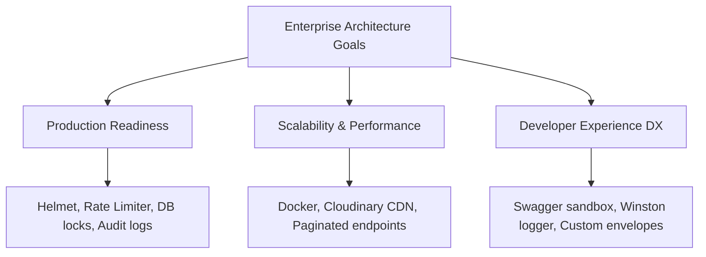

# Enterprise System Enhancements

This document highlights the additional features and best practices implemented to make this platform production-grade, secure, and developer-friendly.

---

## 🚀 Enhancements Implemented Beyond the Core Assignment

```
┌────────────────────────────────────────────────────────────────────────┐
│                          Enterprise Features                           │
├───────────────────────────────┬────────────────────────────────────────┤
│          Dev Experience       │             Production Safety          │
├───────────────────────────────┼────────────────────────────────────────┤
│ • Swagger API Docs            │ • Docker Multi-stage Containerization  │
│ • Winston Structured Logging  │ • Helmet Security Headers              │
│ • Custom Response Formatter   │ • Express Rate Limiter                 │
│ • Auto Email/PDF Invoicing    │ • Prisma Concurrency DB Locks          │
└───────────────────────────────┴────────────────────────────────────────┘
```

### 1. Interactive Developer Sandbox (Swagger)
-   **What:** Dynamic API documentation served at `/crm/api` using JSDoc route annotations and OpenAPI 3.0 schemas.
-   **Why:** Provides an interactive sandbox for frontend developers to test API endpoints directly without needing Postman or Insomnia collections.

### 2. Cloud Media Storage (Multer + Cloudinary)
-   **What:** Integrated middleware that intercepts multipart form files, uploads them to Cloudinary storage, cleans up the local filesystem cache, and returns a secure CDN URL.
-   **Why:** Enables reliable image management for the product catalogue.

### 3. Automated Billing (PDFKit + Nodemailer)
-   **What:** Automatically generates a PDF invoice on the server and emails it to the customer using an SMTP gateway immediately upon delivery confirmation.
-   **Why:** Eliminates manual billing workflows and reduces payment cycles.

### 4. API Utilities (Pagination, Search, and Filters)
-   **What:** Reusable query parameters (`page`, `limit`, `search`, `sortBy`) integrated into Prisma query builders to handle large datasets efficiently.
-   **Why:** Prevents memory overload and UI lag.

### 5. Application Security & Rate Limiting
-   **What:**
    *   **Helmet.js:** Sets HTTP headers (XSS protections, CSP policies, sniffing prevention).
    *   **Express Rate Limit:** Limits logins to 5 attempts per 15 minutes, and general API routes to 100 requests per 15 minutes to prevent DDoS and brute-force attacks.
-   **Why:** Ensures the platform is secure by default against common attack vectors.

### 6. Standardized Error Handling & Response Envelopes
-   **What:** Implements a global Express exception interceptor that returns standardized JSON payloads.
-   **Why:** Simplifies frontend integration by ensuring all APIs return a consistent response shape.

### 7. Automated Build Pipelines (Docker + GitHub Actions)
-   **What:** Multi-stage Docker files for Node/React and a GitHub Actions CI/CD workflow that runs verification checks and deploys code on merges.
-   **Why:** Simplifies environment management and automates the deployment pipeline.

---

## 💡 Rationale: Why These Features Matter



### 🛡️ Production Readiness & Security
Standard assignments often overlook security and concurrency. By implementing database locks (`SELECT FOR UPDATE`), rate limiters, and security headers, this application is protected against double-spending inventory, brute-force login attempts, and common web vulnerabilities.

### 📈 Scalability
Instead of storing product images locally on the server (which fails when scaling across multiple VM instances), images are offloaded to Cloudinary's CDN. Similarly, serverless Neon PostgreSQL and containerized Render hosting allow the application to autoscale automatically to handle traffic spikes.

### 💻 Developer Experience (DX)
By using Swagger, developers can test API endpoints from their browser. Standardized JSON response formats mean frontend developers can build predictable Axios API handlers. Finally, the automated CI/CD pipeline ensures that code is linted, type-checked, and deployed automatically upon merging a pull request.
